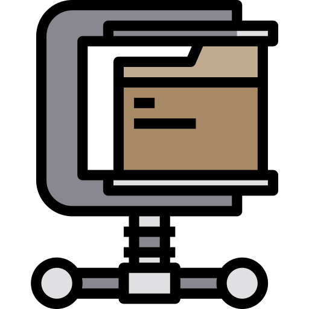

# Third-party Icons attributions

Punchplatform team gives many thanks to the talented people that have provided some icons used in our documentation :

## Dashboard icon
  

Icon made by <a href="https://www.flaticon.com/authors/eucalyp" title="Eucalyp">Eucalyp</a> from <a href="https://www.flaticon.com/" title="Flaticon"> www.flaticon.com</a>

## Compressed File icon

Icon made by <a href="https://www.flaticon.com/authors/payungkead" title="Payungkead">Payungkead</a> from <a href="https://www.flaticon.com/" title="Flaticon"> www.flaticon.com</a>

## Command-line terminal prompt

Icons made by <a href="https://www.flaticon.com/authors/freepik" title="Freepik">Freepik</a> from <a href="https://www.flaticon.com/" title="Flaticon"> www.flaticon.com</a>