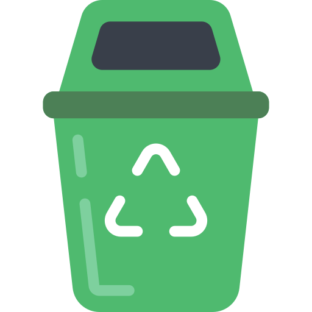
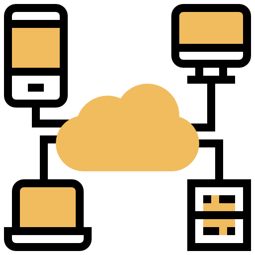
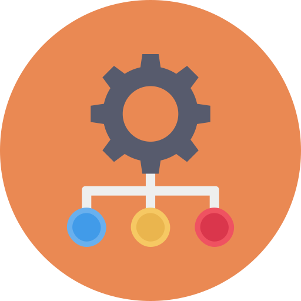

# Third-party Icons attributions

Punchplatform team gives many thanks to the talented people that have provided some icons used in our documentation :

## Dashboard icon
  

Icon made by <a href="https://www.flaticon.com/authors/eucalyp" title="Eucalyp">Eucalyp</a> from <a href="https://www.flaticon.com/" title="Flaticon"> www.flaticon.com</a>

## Compressed File icon

Icon made by <a href="https://www.flaticon.com/authors/payungkead" title="Payungkead">Payungkead</a> from <a href="https://www.flaticon.com/" title="Flaticon"> www.flaticon.com</a>

## Command-line terminal prompt

Icons made by <a href="https://www.flaticon.com/authors/freepik" title="Freepik">Freepik</a> from <a href="https://www.flaticon.com/" title="Flaticon"> www.flaticon.com</a>

## Recycle bin

Icons made by <a href="https://www.flaticon.com/authors/smashicons" title="Smashicons">Smashicons</a> from <a href="https://www.flaticon.com/" title="Flaticon">www.flaticon.com</a>

## Hardhat worker girl

Icons made by <a href="https://www.freepik.com" title="Freepik">Freepik</a> from <a href="https://www.flaticon.com/" title="Flaticon">www.flaticon.com</a>

## Engineer

Icons made by <a href="https://creativemarket.com/eucalyp" title="Eucalyp">Eucalyp</a> from <a href="https://www.flaticon.com/" title="Flaticon">www.flaticon.com</a>

## Laptop

Icons made by <a href="https://www.freepik.com" title="Freepik">Freepik</a> from <a href="https://www.flaticon.com/" title="Flaticon">www.flaticon.com</a>

Icons made by <a href="https://www.flaticon.com/authors/vectors-market" title="Vectors Market">Vectors Market</a> from <a href="https://www.flaticon.com/" title="Flaticon">www.flaticon.com</a>

 
## Desktop

Icons made by <a href="https://www.freepik.com" title="Freepik">Freepik</a> from <a href="https://www.flaticon.com/" title="Flaticon">www.flaticon.com</a>

## Network

Icon made by <a href="https://creativemarket.com/eucalyp" title="Eucalyp">Eucalyp</a> from <a href="https://www.flaticon.com/" title="Flaticon">www.flaticon.com</a>

Icon made by <a href="https://www.flaticon.com/authors/eucalyp" title="Eucalyp">Eucalyp</a> from <a href="https://www.flaticon.com/" title="Flaticon">www.flaticon.com</a>

## Web page

Icons made by <a href="https://www.flaticon.com/authors/linector" title="Linector">Linector</a> from <a href="https://www.flaticon.com/" title="Flaticon">www.flaticon.com</a>

## Internet

Icons made by <a href="https://www.flaticon.com/authors/dinosoftlabs" title="DinosoftLabs">DinosoftLabs</a> from <a href="https://www.flaticon.com/" title="Flaticon">www.flaticon.com</a>

## Settings

Icons made by <a href="https://www.flaticon.com/authors/dinosoftlabs" title="DinosoftLabs">DinosoftLabs</a> from <a href="https://www.flaticon.com/" title="Flaticon">www.flaticon.com</a>

## Program

Icons made by <a href="https://www.flaticon.com/authors/dinosoftlabs" title="DinosoftLabs">DinosoftLabs</a> from <a href="https://www.flaticon.com/" title="Flaticon">www.flaticon.com</a>

